# Quantum Insights: The Premier Analytics Dataset

# "Cancellations Uncovered: Leveraging Market Segments to Boost Hotel Occupancy"

## 1. How does lead time correlate with booking cancellations?


```python
import pandas as pd
import matplotlib.pyplot as plt

df = pd.read_csv('hotel_booking_data.csv')

# Bin lead time into intervals
df['lead_time_bin'] = pd.cut(df['lead_time'], bins=[0, 30, 90, 180, 365, 737], 
                             labels=['0-30', '31-90', '91-180', '181-365', '366+'])

# Calculate cancellation rate per bin
cancel_rate = df.groupby('lead_time_bin')['is_canceled'].mean().reset_index()

plt.figure(figsize=(10, 6))
plt.bar(cancel_rate['lead_time_bin'], cancel_rate['is_canceled'], color='#1f77b4')
plt.title('Cancellation Rate by Lead Time')
plt.xlabel('Lead Time (Days)')
plt.ylabel('Cancellation Rate (%)')
plt.ylim(0, 1)
plt.show()
```

    C:\Users\francisca\AppData\Local\Temp\ipykernel_3592\1246834997.py:11: FutureWarning: The default of observed=False is deprecated and will be changed to True in a future version of pandas. Pass observed=False to retain current behavior or observed=True to adopt the future default and silence this warning.
      cancel_rate = df.groupby('lead_time_bin')['is_canceled'].mean().reset_index()
    


    
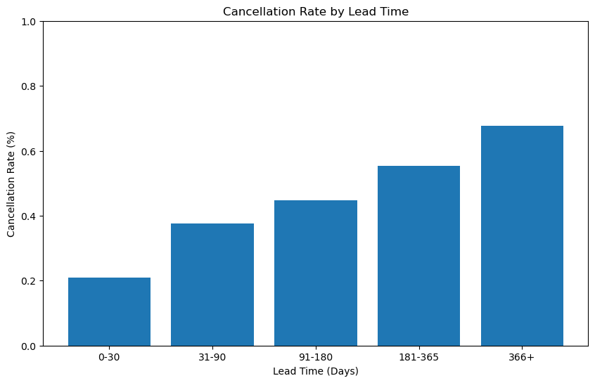
    


## 2. Which customer types have the highest cancellation rates?


```python
cancel_by_type = df.groupby('customer_type')['is_canceled'].mean().sort_values(ascending=False)

plt.figure(figsize=(8, 8))
plt.pie(cancel_by_type, labels=cancel_by_type.index, autopct='%1.1f%%', 
        colors=['#ff9999','#66b3ff','#99ff99','#ffcc99'])
plt.title('Cancellation Rate by Customer Type')
plt.show()
```


    
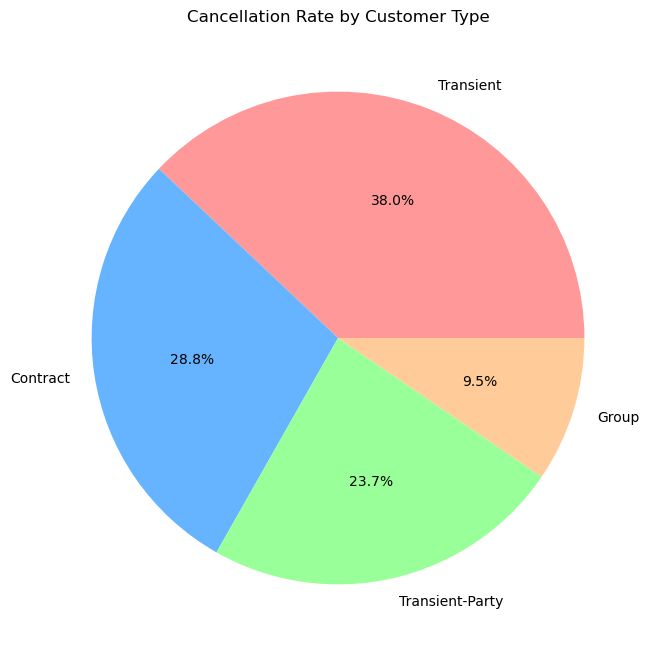
    


## 3. Do repeat guests show different booking patterns?


```python
repeat_guests = df[df['is_repeated_guest'] == 1]
new_guests = df[df['is_repeated_guest'] == 0]

plt.figure(figsize=(10, 6))
plt.hist(repeat_guests['adr'], alpha=0.5, label='Repeat Guests', bins=20, color='blue')
plt.hist(new_guests['adr'], alpha=0.5, label='New Guests', bins=20, color='red')
plt.title('ADR Distribution: Repeat vs. New Guests')
plt.xlabel('ADR')
plt.ylabel('Frequency')
plt.legend()
plt.show()
```


    
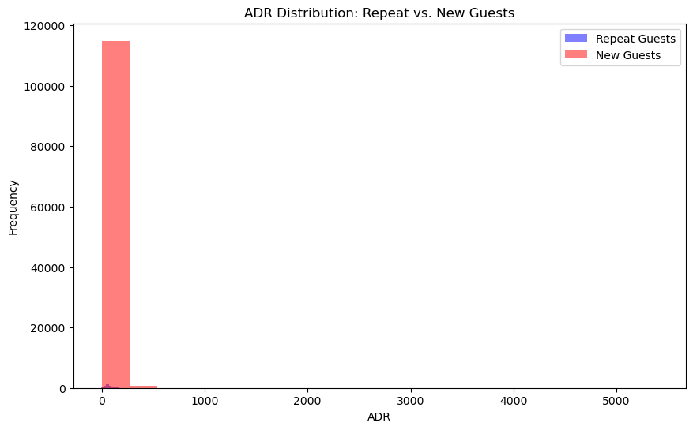
    


## 4. How do children/babies influence room type and ADR?


```python
df['has_children'] = df['children'] + df['babies'] > 0

room_type_by_children = df.groupby(['has_children', 'reserved_room_type']).size().unstack()

room_type_by_children.plot(kind='bar', stacked=True, figsize=(10, 6))
plt.title('Room Type Selection: With vs. Without Children')
plt.xlabel('Has Children')
plt.ylabel('Count')
plt.show()
```


    
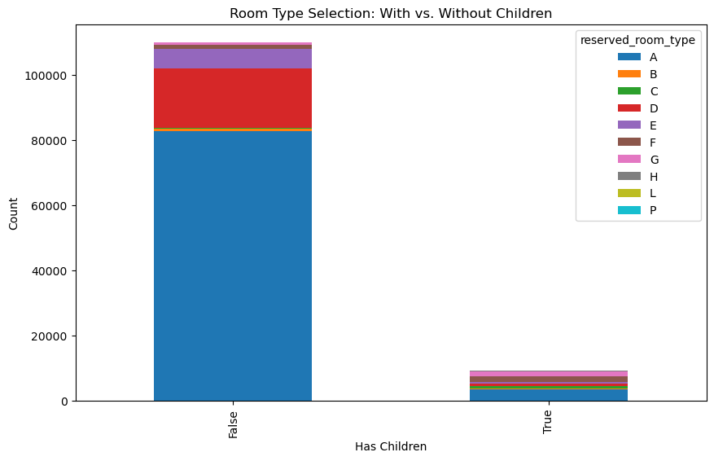
    


## 5. Which countries contribute the most bookings?


```python
top_countries = df['country'].value_counts().head(10)

plt.figure(figsize=(10, 6))
top_countries.plot(kind='barh', color='#2ca02c')
plt.title('Top 10 Countries by Bookings')
plt.xlabel('Number of Bookings')
plt.ylabel('Country')
plt.show()
```


    
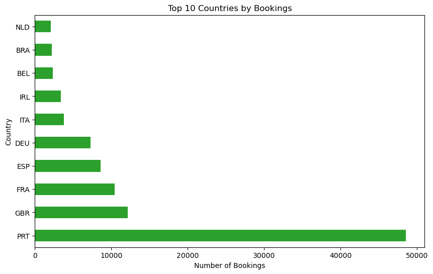
    


## 6. What is the relationship between room type and ADR?


```python
room_adr = df.groupby('assigned_room_type')['adr'].mean().sort_values()

plt.figure(figsize=(10, 6))
plt.bar(room_adr.index, room_adr.values, color='#9467bd')
plt.title('ADR by Room Type')
plt.xlabel('Room Type')
plt.ylabel('Average ADR ($)')
plt.show()
```


    
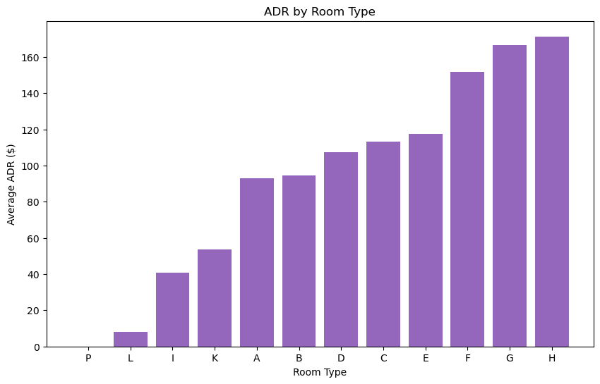
    


## 7. How do special requests impact ADR and cancellations?


```python
special_requests = df.groupby('total_of_special_requests').agg({'adr': 'mean', 'is_canceled': 'mean'})

plt.figure(figsize=(10, 6))
plt.plot(special_requests.index, special_requests['adr'], marker='o', label='ADR')
plt.plot(special_requests.index, special_requests['is_canceled']*100, marker='o', label='Cancellation Rate (%)')
plt.title('Impact of Special Requests on ADR and Cancellations')
plt.xlabel('Number of Special Requests')
plt.legend()
plt.show()
```


    
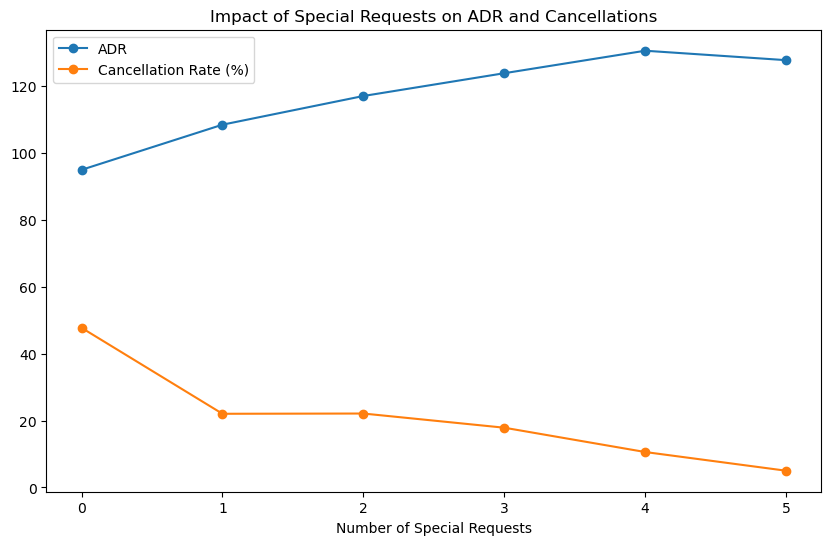
    


## 8. Which market segments generate the highest revenue?


```python
df['total_revenue'] = df['adr'] * (df['stays_in_weekend_nights'] + df['stays_in_week_nights'])
revenue_by_segment = df.groupby('market_segment')['total_revenue'].sum().sort_values(ascending=False)

plt.figure(figsize=(10, 6))
revenue_by_segment.plot(kind='barh', color='#2ca02c')
plt.title('Total Revenue by Market Segment')
plt.xlabel('Revenue ($)')
plt.ylabel('Market Segment')
plt.show()
```


    
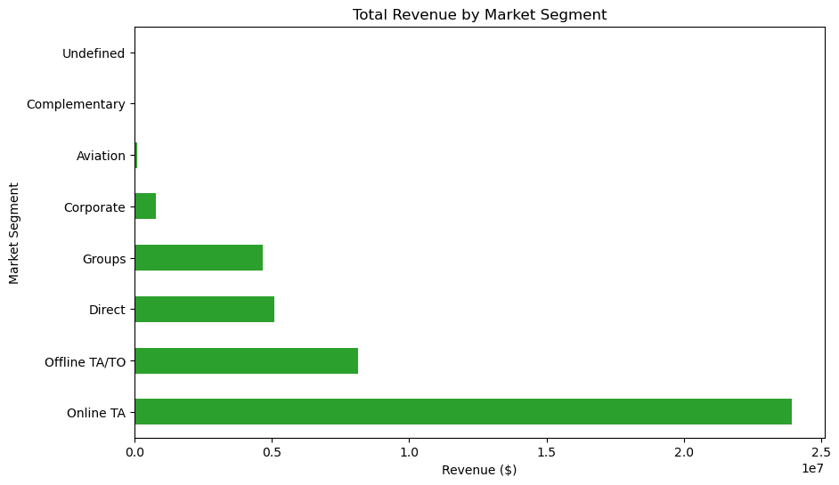
    


 ## 9. Does deposit type influence cancellations?


```python
cancel_by_deposit = df.groupby('deposit_type')['is_canceled'].mean()

plt.figure(figsize=(8, 8))
plt.pie(cancel_by_deposit, labels=cancel_by_deposit.index, autopct='%1.1f%%', 
        colors=['#ff9999','#66b3ff','#99ff99'])
plt.title('Cancellation Rate by Deposit Type')
plt.show()
```


    
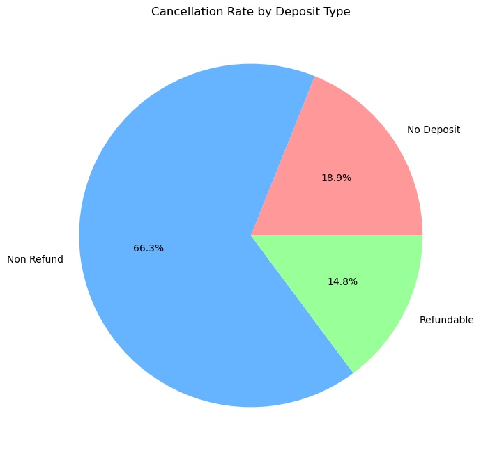
    


## 10. How does seasonal demand affect ADR?


```python
months = ['January', 'February', 'March', 'April', 'May', 'June', 
          'July', 'August', 'September', 'October', 'November', 'December']
df['arrival_date_month'] = pd.Categorical(df['arrival_date_month'], categories=months, ordered=True)

monthly_adr = df.groupby('arrival_date_month')['adr'].mean()

plt.figure(figsize=(12, 6))
plt.plot(monthly_adr.index, monthly_adr.values, marker='o', color='tab:red')
plt.title('Monthly ADR Trends')
plt.xlabel('Month')
plt.ylabel('ADR ($)')
plt.xticks(rotation=45)
plt.show()
```

    C:\Users\francisca\AppData\Local\Temp\ipykernel_3592\1021355954.py:5: FutureWarning: The default of observed=False is deprecated and will be changed to True in a future version of pandas. Pass observed=False to retain current behavior or observed=True to adopt the future default and silence this warning.
      monthly_adr = df.groupby('arrival_date_month')['adr'].mean()
    


    
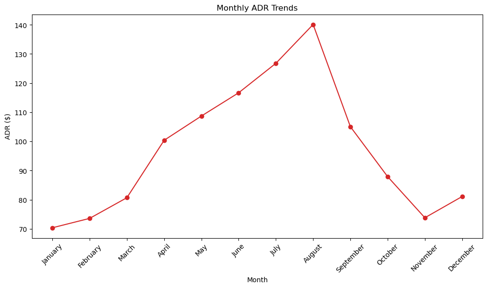
    


## 11. What is the average wait time, and does it correlate with cancellations?


```python
wait_time = df.groupby('days_in_waiting_list')['is_canceled'].mean().reset_index()

plt.figure(figsize=(10, 6))
plt.scatter(wait_time['days_in_waiting_list'], wait_time['is_canceled'], alpha=0.5)
plt.title('Cancellation Rate by Wait Time')
plt.xlabel('Days in Waiting List')
plt.ylabel('Cancellation Rate')
plt.show()
```


    
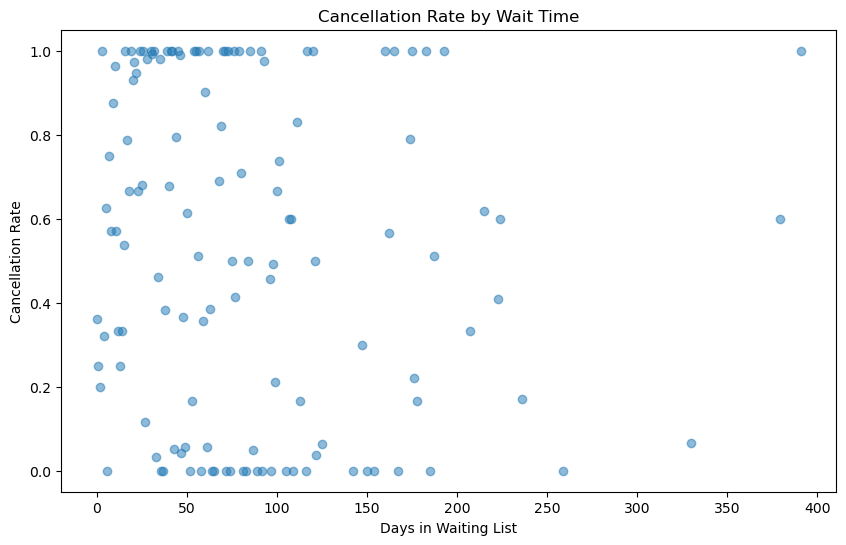
    


## 12. How often do guests receive a different room type?


```python
room_mismatch = pd.crosstab(df['reserved_room_type'], df['assigned_room_type'])

plt.figure(figsize=(10, 6))
plt.imshow(room_mismatch, cmap='Blues')
plt.colorbar()
plt.title('Room Type Mismatch: Reserved vs. Assigned')
plt.xlabel('Assigned Room Type')
plt.ylabel('Reserved Room Type')
plt.show()
```


    
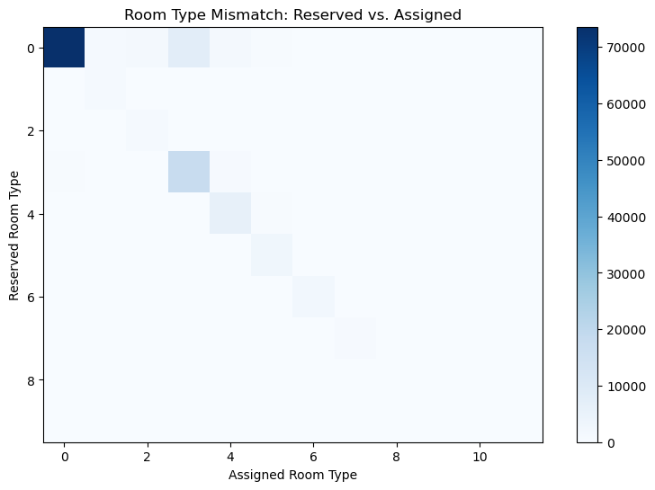
    


## 13. Which agents/companies generate the most bookings?


```python
top_agents = df['agent'].value_counts().head(10)

plt.figure(figsize=(10, 6))
top_agents.plot(kind='bar', color='#17becf')
plt.title('Top 10 Agents by Bookings')
plt.xlabel('Agent ID')
plt.ylabel('Number of Bookings')
plt.show()
```


    
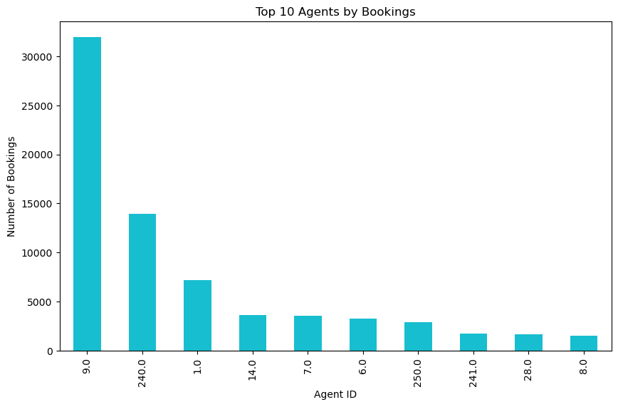
    


## 14. Length of stay for corporate vs. leisure travelers?


```python
corporate = df[df['market_segment'] == 'Corporate']['stays_in_week_nights']
leisure = df[df['market_segment'] == 'Transient']['stays_in_week_nights']

plt.figure(figsize=(10, 6))
plt.boxplot([corporate, leisure], labels=['Corporate', 'Leisure'])
plt.title('Length of Stay: Corporate vs. Leisure')
plt.ylabel('Nights')
plt.show()
```

    C:\Users\francisca\AppData\Local\Temp\ipykernel_3592\3332526698.py:5: MatplotlibDeprecationWarning: The 'labels' parameter of boxplot() has been renamed 'tick_labels' since Matplotlib 3.9; support for the old name will be dropped in 3.11.
      plt.boxplot([corporate, leisure], labels=['Corporate', 'Leisure'])
    


    
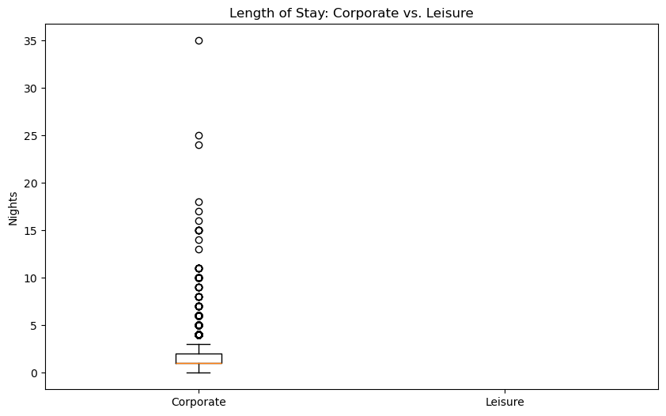
    


## 15. Do guests with previous cancellations cancel again?


```python
df['has_previous_cancellations'] = df['previous_cancellations'] > 0
cancel_history = df.groupby('has_previous_cancellations')['is_canceled'].mean()

plt.figure(figsize=(6, 6))
plt.bar(['No', 'Yes'], cancel_history, color=['#1f77b4', '#ff7f0e'])
plt.title('Cancellation Rate by Previous Cancellations')
plt.ylabel('Cancellation Rate')
plt.show()
```


    
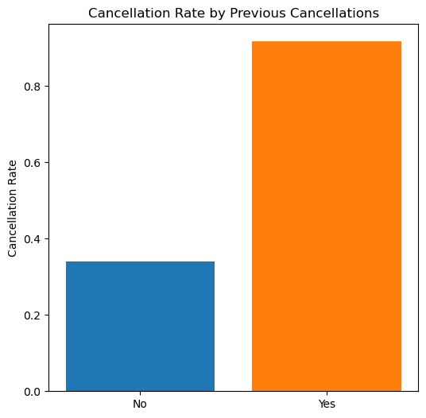
    


## 16. How does distribution channel influence cancellations?


```python
cancel_by_channel = df.groupby('distribution_channel')['is_canceled'].mean()

plt.figure(figsize=(8, 8))
plt.pie(cancel_by_channel, labels=cancel_by_channel.index, autopct='%1.1f%%', 
        colors=['#ff9999','#66b3ff','#99ff99','#ffcc99'])
plt.title('Cancellation Rate by Distribution Channel')
plt.show()
```


    
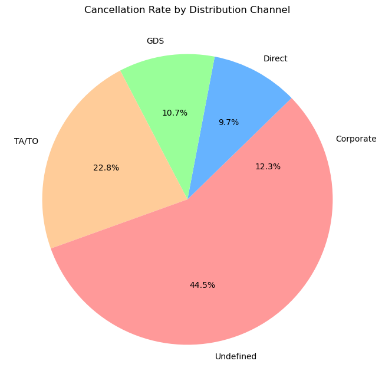
    


## 17. Are bookings with changes more likely to be canceled?


```python
booking_changes = df.groupby('booking_changes')['is_canceled'].mean().reset_index()

plt.figure(figsize=(10, 6))
plt.plot(booking_changes['booking_changes'], booking_changes['is_canceled'], marker='o')
plt.title('Cancellation Rate by Number of Booking Changes')
plt.xlabel('Number of Changes')
plt.ylabel('Cancellation Rate')
plt.show()
```


    
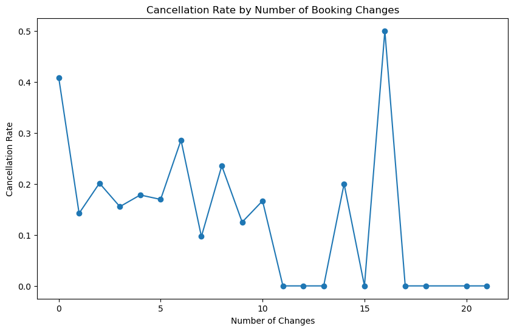
    


## 18. Which meal plans are most popular and profitable?


```python
meal_popularity = df['meal'].value_counts()
meal_adr = df.groupby('meal')['adr'].mean()

fig, (ax1, ax2) = plt.subplots(1, 2, figsize=(14, 6))
meal_popularity.plot(kind='bar', ax=ax1, color='#1f77b4')
ax1.set_title('Meal Plan Popularity')
ax1.set_ylabel('Count')

meal_adr.plot(kind='line', ax=ax2, marker='o', color='tab:red')
ax2.set_title('ADR by Meal Plan')
ax2.set_ylabel('ADR ($)')
plt.show()
```


    
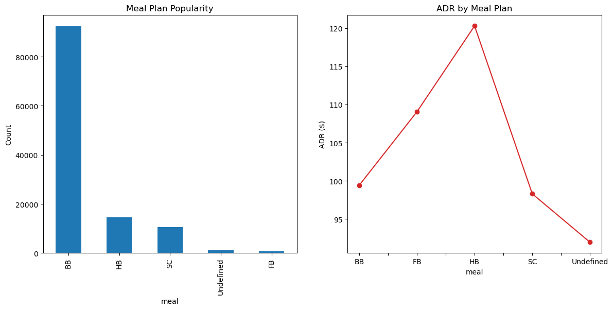
    


## 19. How does car parking correlate with booking duration?


```python
parking = df[df['required_car_parking_spaces'] > 0]['stays_in_week_nights']
no_parking = df[df['required_car_parking_spaces'] == 0]['stays_in_week_nights']

plt.figure(figsize=(10, 6))
plt.boxplot([parking, no_parking], labels=['With Parking', 'Without Parking'])
plt.title('Length of Stay: With vs. Without Parking')
plt.ylabel('Nights')
plt.show()
```

    C:\Users\francisca\AppData\Local\Temp\ipykernel_3592\1563590124.py:5: MatplotlibDeprecationWarning: The 'labels' parameter of boxplot() has been renamed 'tick_labels' since Matplotlib 3.9; support for the old name will be dropped in 3.11.
      plt.boxplot([parking, no_parking], labels=['With Parking', 'Without Parking'])
    


    
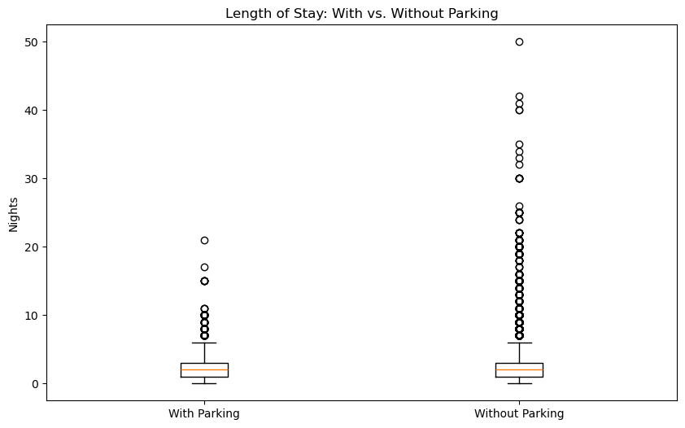
    


## 20. What are the trends in no-show rates?


```python
no_shows = df[df['reservation_status'] == 'No-Show']
no_show_rate = no_shows.groupby('arrival_date_month').size() / df.groupby('arrival_date_month').size()

plt.figure(figsize=(12, 6))
plt.plot(no_show_rate.index, no_show_rate.values, marker='o', color='tab:red')
plt.title('Monthly No-Show Rates')
plt.xlabel('Month')
plt.ylabel('No-Show Rate (%)')
plt.xticks(rotation=45)
plt.show()
```

    C:\Users\francisca\AppData\Local\Temp\ipykernel_3592\1471330045.py:2: FutureWarning: The default of observed=False is deprecated and will be changed to True in a future version of pandas. Pass observed=False to retain current behavior or observed=True to adopt the future default and silence this warning.
      no_show_rate = no_shows.groupby('arrival_date_month').size() / df.groupby('arrival_date_month').size()
    C:\Users\francisca\AppData\Local\Temp\ipykernel_3592\1471330045.py:2: FutureWarning: The default of observed=False is deprecated and will be changed to True in a future version of pandas. Pass observed=False to retain current behavior or observed=True to adopt the future default and silence this warning.
      no_show_rate = no_shows.groupby('arrival_date_month').size() / df.groupby('arrival_date_month').size()
    


    
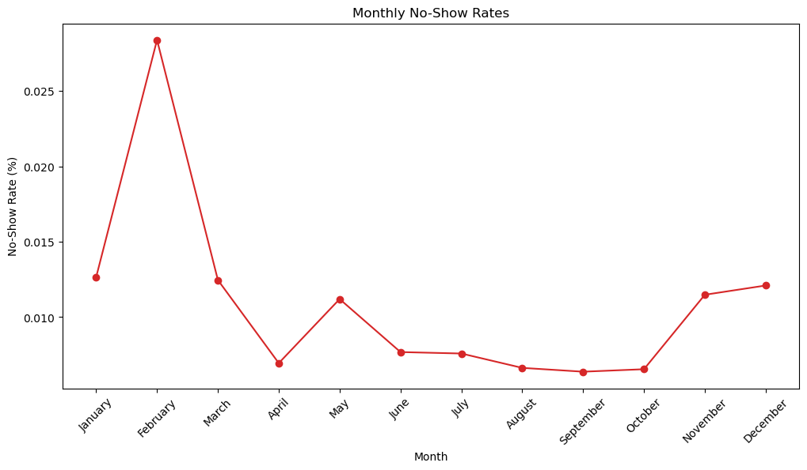
    

